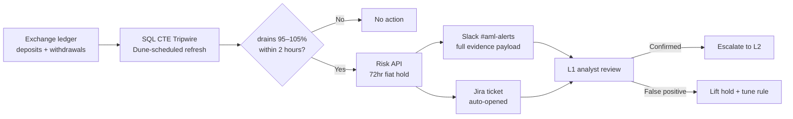

# Sentinel — AML Layering Detection Prototype

> *Catch the dump before the fiat leaves the building.*

A proactive AML tripwire designed for crypto exchanges. Pairs altcoin deposits with fiat withdrawals in real time, flags accounts dumping volatile alts to fiat in under two hours, and auto-applies a 72-hour fiat-withdrawal cooldown **before** the funds settle.

This repo is the design + write-up for the prototype. The detection logic runs on [Dune Analytics](https://dune.com/satoshi1015); the alert/mitigation pipeline is presented here as a designed architecture with working mockups.

---

## 🔗 Live & Visual

- **Interactive showcase** — [dtneverland.github.io/sentinel-aml-detection/showcase](https://dtneverland.github.io/sentinel-aml-detection/showcase/) — full Sentinel design with SQL, workflow, and Slack alert UI ([source](./showcase/index.html))
- **Runnable detection query** — [`/sql/detect_pass_through_layering.sql`](./sql/detect_pass_through_layering.sql)
- **Live on Dune** — [dune.com/satoshi1015](https://dune.com/satoshi1015)

---

## The problem in one paragraph

Traditional AML monitoring at crypto exchanges is **threshold-based**: large transfers and high-velocity patterns trigger alerts after the fact. But sophisticated layering moves *small* and *fast* — a user deposits volatile altcoins (ADA, XRP), converts to fiat, and withdraws to a bank within minutes. By the time analysts review the alert, the fiat is already out. Sentinel closes that gap by detecting the pass-through pattern in flight and applying a reversible 72-hour cooldown before the withdrawal clears.

## What's built vs. designed

| Component | Status | Notes |
|---|---|---|
| **SQL CTE detection logic** | ✅ Built | Runnable query in [`/sql`](./sql/detect_pass_through_layering.sql); pairing logic validated on Dune Analytics against on-chain transfer data (an on-chain proxy — fiat rails only exist inside an exchange) |
| **Detection cadence** | ✅ Built | Dune's scheduled refresh |
| **Risk API (72hr fiat-withdrawal hold)** | 📐 Designed | Architecture + API contract; not integrated to a live exchange |
| **Slack `#aml-alerts` webhook** | 🎨 Mocked | Full visual mockup with evidence payload, action buttons (see showcase) |
| **Jira ticket auto-creation** | 📐 Designed | Architecture + payload schema; no live Jira integration |
| **L1/L2 analyst escalation flow** | 📐 Designed | Workflow + UX described in [docs/architecture.md](./docs/architecture.md) |

This is honest scoping: the **detection** is real and runnable. The **response pipeline** is designed and mocked to show end-to-end thinking about how AML detection plugs into an exchange's existing compliance ops.

## Architecture at a glance



Full breakdown in [docs/architecture.md](./docs/architecture.md).

## Repo map

```
sentinel-aml-detection/
├── README.md                       you are here
├── docs/
│   ├── problem-statement.md       why pass-through layering matters
│   ├── design-decisions.md        why 95–105%, why 2 hours, why 72hr hold — and the known evasions
│   └── architecture.md            full 4-step pipeline breakdown
├── sql/
│   └── detect_pass_through_layering.sql   the runnable detection query
└── showcase/
    └── index.html                 interactive design page (SQL + workflow + Slack mockup)
```

## Design philosophy

Three principles, made explicit in the docs:

1. **Auto-mitigate first, review after** — A reversible 72-hour hold costs the legitimate user 3 days of inconvenience. Letting a bad actor cash out costs the exchange the entire withdrawn amount + regulatory exposure. The math favors mitigation.

2. **L1 analyst experience is the product** — Every alert arrives pre-populated with full evidence (user_id, pattern, ratios, time delta, transaction IDs) and one-click escalation paths. Reduces review time from minutes to seconds.

3. **Honest scoping** — A junior analyst's portfolio piece isn't a production system. This repo distinguishes detection (built) from response (designed) so the depth of thinking is visible without overclaiming the deployment.


