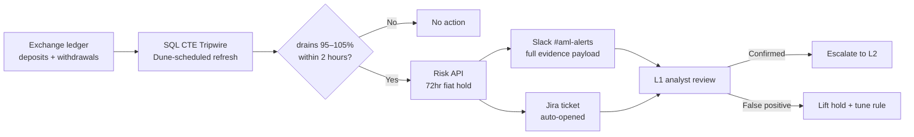

# Sentinel — AML Detection Toolkit

> *Catch the dump before the fiat leaves the building — and check the buyer before the bank checks you.*

Two complementary anti-money-laundering modules covering both sides of a crypto exchange's exposure:

| | Module | Side | Stack | Status |
|---|---|---|---|---|
| **1** | [Pass-Through Layering Detection](#module-1--pass-through-layering-detection) | Exchange-side — catch launderers in flight | SQL / Dune | Detection built; response designed |
| **2** | [P2P Counterparty Scorer](#module-2--p2p-counterparty-risk-scorer) | User-side — stop a retail seller becoming the next hop | Python | Built, red-teamed, 48 tests |

They are mirror images of the same typology. Module 1 watches an exchange's own ledger for deposit→fiat pass-through; Module 2 lets a retail P2P seller score a counterparty's public listing *before* trading, so dirty fiat never reaches their bank account in the first place.

---

## Module 1 — Pass-Through Layering Detection

> *Catch the dump before the fiat leaves the building.*

A proactive AML tripwire for crypto exchanges. Pairs altcoin deposits with fiat withdrawals in real time, flags accounts draining 95–105% of a deposit to fiat in under two hours, and auto-applies a reversible 72-hour fiat-withdrawal cooldown **before** the funds settle.

**Live & visual**
- **Interactive showcase** — [dtneverland.github.io/sentinel-aml-detection/showcase](https://dtneverland.github.io/sentinel-aml-detection/showcase/) ([source](./showcase/index.html))
- **Runnable query** — [`/sql/detect_pass_through_layering.sql`](./sql/detect_pass_through_layering.sql)
- **Live on Dune** — [dune.com/satoshi1015](https://dune.com/satoshi1015)

Traditional exchange AML is **threshold-based**: large transfers and high-velocity patterns trigger alerts after the fact. Sophisticated layering moves *small* and *fast* — deposit volatile alts (ADA, XRP), convert to fiat, withdraw within minutes. By the time analysts review, the fiat is gone. This module detects the pass-through pattern in flight and applies a reversible hold before the withdrawal clears.



| Component | Status | Notes |
|---|---|---|
| **SQL CTE detection logic** | ✅ Built | Runnable query; pairing logic validated on Dune against on-chain transfer data (an on-chain proxy — fiat rails only exist inside an exchange) |
| **Risk API (72hr hold)** | 📐 Designed | Architecture + API contract |
| **Slack `#aml-alerts` webhook** | 🎨 Mocked | Full visual mockup with evidence payload (see showcase) |
| **Jira ticket auto-creation** | 📐 Designed | Architecture + payload schema |
| **L1/L2 analyst escalation** | 📐 Designed | Workflow in [docs/architecture.md](./docs/architecture.md) |

Honest scoping: the **detection** is real and runnable; the **response pipeline** is designed and mocked to show end-to-end thinking. Full breakdown in [docs/architecture.md](./docs/architecture.md), threshold rationale in [docs/design-decisions.md](./docs/design-decisions.md).

---

## Module 2 — P2P Counterparty Risk Scorer

> *Check the buyer before the bank checks you.*

The user-side half. A retail P2P seller who matches with a mule buyer receives tainted fiat; when a scam victim reports the chain, the bank freezes the seller's account too. This module scores a counterparty's **publicly visible listing** — ad premium, order velocity, account age, completion rate — and gives a plain pre-trade verdict.

**🌐 No-install web tool** — [dtneverland.github.io/sentinel-aml-detection/showcase/p2p-check.html](https://dtneverland.github.io/sentinel-aml-detection/showcase/p2p-check.html). Built for the actual end user: a retail trader with no terminal, no Python, no Claude. Paste the buyer's numbers, get a verdict. The scoring runs entirely in the browser (a verified 1:1 port of `core/p2p_scorer.py`) — nothing is sent anywhere. The page doubles as the user manual.

For developers / scripting:
```
py check_trader.py --premium 2.4 --age 8 --orders30 600 --finish 99
  →  Risk score 0.95 / 1.00   Verdict: ⛔ DO NOT TRADE
```

Three signals combined noisy-OR, every threshold **calibrated against real Binance P2P data** rather than guessed, then **red-teamed** until it caught the mules that slip through:

```
EXCHANGE profile     mule recall  58%   false alarms 0%
RETAIL-SAFE profile  mule recall 100%   false alarms 0%   ← default
```

The full design, the two model holes red-teaming exposed and fixed, and the one residual evasion honestly quantified (not hidden) are in **[docs/p2p-scorer.md](./docs/p2p-scorer.md)**.

```
py -m pytest tests/                            # 48 tests
PYTHONPATH=. py redteam/adversarial_cases.py   # confusion matrix
PYTHONPATH=. py redteam/second_pass.py         # monotonicity + type + residual gap
```

---

## Repo map

```
sentinel-aml-detection/
├── README.md                       you are here
│
│   ── Module 1: layering detection (SQL / Dune) ──
├── sql/
│   └── detect_pass_through_layering.sql   the runnable detection query
├── showcase/
│   └── index.html                  interactive design page (SQL + workflow + Slack mockup)
├── docs/
│   ├── problem-statement.md        why pass-through layering matters
│   ├── design-decisions.md         why 95–105%, why 2h, why 72hr hold — and known evasions
│   ├── architecture.md             full 4-step pipeline breakdown
│   └── p2p-scorer.md               ── Module 2 design + red-team writeup ──
│
│   ── Module 2: P2P counterparty scorer (Python) ──
├── check_trader.py                 CLI — run before a trade
├── config_loader.py                frozen AppConfig (+ retail_safe preset)
├── core/
│   └── p2p_scorer.py               P2PBehavioralScorer + P2PTraderMetadata
├── redteam/
│   ├── data/                       real Binance P2P snapshot (calibration ground truth)
│   ├── adversarial_cases.py        round 1: confusion matrix on 13 profiles
│   ├── second_pass.py              round 2: monotonicity, type confusion, residual gap
│   └── profile_compare.py          recall vs false-alarm across both profiles
└── tests/
    └── test_p2p_scorer.py          48 tests: scenarios, validation, guarantees, presets
```

## Design philosophy

1. **Auto-mitigate first, review after** (Module 1) — a reversible 72-hour hold costs a legitimate user 3 days; letting a bad actor cash out costs the exchange the whole amount plus regulatory exposure. The math favors mitigation.

2. **The cost of being wrong is asymmetric** (Module 2) — for a retail seller, a false positive means skipping one trader; a false negative means a frozen bank account. So the default profile is tuned recall-first.

3. **Data over guesses, and honest scoping** — every threshold is calibrated against real market data and every known evasion is documented (and the unclosable one quantified) rather than hidden. A junior analyst's portfolio piece isn't a production system; this repo shows the depth of thinking without overclaiming the deployment.
