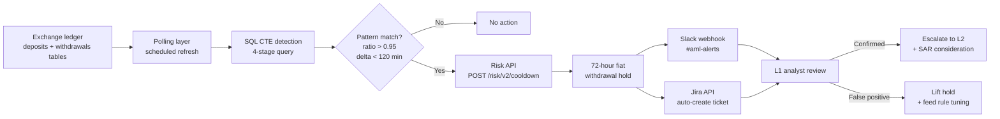

# Architecture

The full Sentinel pipeline, with the built/designed boundary made explicit.

## End-to-end flow



## Component breakdown

### 1. Polling layer (designed — Dune-scheduled in built version)

| What | Status |
|---|---|
| Built | Dune Analytics scheduled refresh against on-chain data |
| Designed (exchange version) | Airflow DAG `aml_tripwires` polling `ledger.deposits` and `ledger.withdrawals` every 5 minutes |

The 5-minute cadence is short enough to fire before most fiat batches clear, long enough to avoid hammering production ledger tables.

### 2. SQL CTE detection engine (built)

The detection query is structured as four sequential CTEs — each isolatable, debuggable, and testable:

| Stage | Purpose |
|---|---|
| `alt_deposits` | Pull confirmed altcoin deposits (ADA, XRP) from the last 24h |
| `fiat_withdrawals` | Pull pending/processing fiat withdrawals (MYR, IDR, ZAR, EUR, GBP) from the same window |
| `paired_flows` | Self-join by `user_id` where the withdrawal happened *after* a deposit — compute `minutes_elapsed` and `withdrawal_ratio` |
| **Final SELECT** | Apply the tripwire: `minutes_elapsed < 120 AND withdrawal_ratio > 0.95` |

See [`/showcase/index.html`](../showcase/index.html) for the full annotated SQL.

**Why this structure**: CTEs are auditable. A compliance officer or auditor can read the query top-down and verify the logic at each stage. Single-statement monolithic queries are faster to write but harder to defend in an audit conversation.

### 3. Risk API (designed)

A single POST endpoint that places the 72-hour cooldown:

```
POST /risk/v2/cooldown
Content-Type: application/json
Authorization: Bearer <service-token>

{
  "user_id": "LN-88421",
  "duration_hours": 72,
  "scope": "fiat_withdrawal",
  "reason_code": "PASS_THROUGH_LAYERING",
  "evidence_ref": "risk_event_{uuid}"
}
```

Behavior:
- Idempotent on `evidence_ref` — same flag firing twice doesn't extend the hold
- Reversible by L2 compliance role via the matching DELETE endpoint
- Logs to a permanent action table for audit reconstruction

### 4. Slack webhook (mocked)

Pushes a structured message to `#aml-alerts` channel with:
- Severity pill (`🚨 HIGH SEVERITY`)
- Pattern name and user reference
- Evidence grid: user_id, pattern (e.g. `ADA → MYR`), time delta, deposit value, withdrawal value, ratio
- Raw payload as a code block (for analysts who want the underlying data)
- Auto-mitigation banner confirming the hold is already in place
- One-click action buttons: View account · Open Jira ticket · Escalate to L2 · Mark false positive

See the [showcase page](../showcase/index.html) for the full visual.

### 5. Jira ticket auto-creation (designed)

A complementary action to the Slack alert. Creates a ticket on the AML board with:
- Title: `[AML] Pass-Through Layering — {user_ref}`
- Description: same evidence payload as the Slack message, formatted as a Jira-friendly markdown block
- Assignee: round-robin to L1 analyst on-shift
- Linked Slack thread URL for context continuity
- Severity label and reason code matching the Risk API call

### 6. L1/L2 analyst experience (designed)

The alert is **documentation and action surface**, not a decision request. By the time the analyst sees it, the hold is in place. Their job is:

1. Review the evidence (already pre-populated — no data-gathering)
2. Decide: confirmed pattern, false positive, or needs L2 input
3. Click the matching action button (Escalate / Mark FP / Open ticket)

This compresses what is typically a 5–15 minute alert-handling task into ~30 seconds for clear cases. Ambiguous cases escalate to L2 with the full context still attached.

## What changes between "designed" and "built" pieces

The current built version (Dune SQL) demonstrates that the **detection signal works** on real on-chain data. The designed-but-not-built pieces (Risk API, Slack, Jira) are the integrations that would only exist *inside* an exchange — they need real ledger tables, real authentication, real Slack workspaces, and real Jira boards.

That distinction matters. A junior compliance candidate can't deploy a 72-hour fiat-withdrawal hold against real customer accounts; that takes employment at an exchange. What they *can* do — and what this prototype demonstrates — is design the rule, prove it fires on real data, and document the response architecture so the next compliance engineer reading this can pick it up and ship it.
